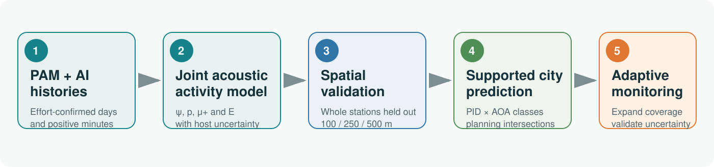

# AI-assisted acoustic monitoring for adaptive urban wildlife planning

[](https://github.com/Fly-Carrot/urban-koel-acoustic-planning/actions/workflows/contract.yml)
[](https://github.com/Fly-Carrot/urban-koel-acoustic-planning/actions/workflows/verify.yml)
[](LICENSE)
[](https://github.com/Fly-Carrot/urban-koel-acoustic-planning/releases)

**Urban planning shapes where wildlife persists—and where people hear it.** This repository turns sparse, AI-assisted passive-acoustic observations of Asian Koel (*Eudynamys scolopaceus*) into detection-corrected ecological inference, spatially validated city prediction, explicit prediction-support classes, planning summaries and the next monitoring deployment.

<p align="center">
  
</p>

> [!IMPORTANT]
> **Reproducibility scope.** `make verify` reproduces the reported derived tables, curves and numerical checks from frozen, non-sensitive processed and posterior summaries. It does not reconstruct AI detections from raw audio or repeat exact site-level environmental extraction, because raw recordings, exact monitoring coordinates, detailed POI locations and restricted source assets are not redistributed here. The `full` profile is therefore conditional on access to the documented model-ready inputs.

## Start here

Requirements: R 4.5 or later, GNU Make, and either `sha256sum`, `shasum`, or `openssl`.

```bash
git clone https://github.com/Fly-Carrot/urban-koel-acoustic-planning.git
cd urban-koel-acoustic-planning
make setup
make verify
make test
```

The verification profile uses base R only and finishes in under a minute on a typical laptop. Results are written to `outputs/`, which is intentionally ignored by Git.

## What the workflow estimates

The analysis separates three linked features of acoustic activity:

- weekly acoustic opportunity, \(\psi\): the probability that Koel vocal activity is present in a station-week;
- daily detectability, \(p\): the probability of retaining at least one Koel-positive sampled minute on a surveyed day, conditional on weekly opportunity;
- positive-day sampled-minute probability, \(\mu^+\): how densely Koel-positive sampled minutes occur after the daily detection hurdle is crossed.

Aligned posterior draws give sampled-minute acoustic exposure:

\[
E = \psi \times p \times \mu^+.
\]

Potential-host acoustic opportunity is used as life-history-informed predictive context. It does not demonstrate host use or local parasitism. Ecological neighbourhoods are station-centred circles; 250 m was retained after matched 100, 250 and 500 m transfer comparisons. HEX cells index city prediction and reporting, not the ecological measurement scale.

## Reproduction profiles

| Profile | Command | Purpose | Public status |
|---|---|---|---|
| `smoke` | `make smoke` | Run all 14 drivers on synthetic/example inputs and check interfaces | Available |
| `verify` | `make verify` | Rebuild reported summaries from frozen public products and validate manuscript anchors | Available and used in CI |
| `full` | `make full` | Document the private-input contract and stop with an explicit boundary message | Interface reserved; private adapters and restricted inputs are not distributed |

## Scientific pipeline

The public analysis interface contains exactly 14 ordered drivers:

1. preflight and input contracts;
2. effort-confirmed survey histories;
3. daily detection-backbone comparison;
4. landscape and spatial predictors;
5. three potential-host opportunity models;
6. Koel weekly acoustic opportunity;
7. spatial transfer and scale validation;
8. joint calling density and acoustic exposure;
9. citywide activity prediction;
10. Prediction Interpretation Domain (PID) and Area of Applicability (AOA);
11. overlap with planning-sensitive places and urban functions;
12. Coverage Expansion and Prediction Validation sequences;
13. manuscript-facing outputs; and
14. release-wide validation.

Every driver has an input/output contract and a detailed plain-language card in [`docs/script_reference.md`](docs/script_reference.md). The model and predictor formulae are frozen in [`config/model_registry.csv`](config/model_registry.csv) and [`config/predictor_registry.csv`](config/predictor_registry.csv).

## What `make verify` checks

- 31 monitoring stations, 9,912 effort-confirmed station-days, 2,682 Koel-positive days, 1,500 station-weeks and 1,398,905 sampled-minute opportunities;
- the primary coordinate-free, three-host transfer formula and its detection backbone;
- whole-station transfer improvement, multiscale decisions and residual spatial diagnostics;
- coefficient and exposure anchors used in the manuscript;
- four prediction-support classes summing to 13,714 HEX cells;
- planning summaries based on 5,745 Primary Results + Moderate Extrapolation cells;
- nested 5-, 10- and 15-station deployment scenarios, including the reported 15-station example;
- absence of exact coordinates, absolute local paths, credentials and prohibited binary inputs in the tracked release.

## Repository map

```text
analysis/   14 ordered public drivers
R/          shared, tested functions
stan/       exact public model source used by the conditional full profile
config/     formula, predictor, seed and provenance registries
data/       example data and frozen non-sensitive reference summaries
docs/       reproduction, script, data and scientific-boundary documentation
tests/      release-contract and numerical tests
tools/      curation and contract utilities; not analysis drivers
```

## Prediction support is part of the result

PID describes ecological interpretation context; AOA describes similarity to the monitored predictor space. Their cross-classification gives:

- **Primary Results** — appropriate for core planning interpretation;
- **Moderate Extrapolation** — useful for screening with field confirmation;
- **Monitoring Gaps** — environments where new monitoring is needed before interpreting predicted values;
- **Outside the Reporting Domain** — categorical permanent-water cells, shown as unavailable rather than zero activity.

These labels never multiply, shrink or otherwise change predicted activity.

## Data, privacy and licensing

The repository includes only anonymised aggregate or simulated data admitted by the release contract and checksummed manifest. Exact recorder locations, candidate deployment coordinates, raw audio, granular POI records, third-party geospatial rasters and model weights are excluded. See [`data/README.md`](data/README.md), [`data/LICENSE.md`](data/LICENSE.md), [`docs/data_access.md`](docs/data_access.md), and [`THIRD_PARTY_NOTICES.md`](THIRD_PARTY_NOTICES.md).

Code is released under BSD-3-Clause. Curated project-owned summary data are released under CC BY 4.0; third-party data remain governed by their original licences.

## Citation

This is a pre-publication software release (`v0.1.0`). Please cite the repository metadata in [`CITATION.cff`](CITATION.cff). A versioned archival DOI and article citation will be added after manuscript acceptance.

## Contributing and support

Please use a reproducible issue template for bugs or verification discrepancies. See [`CONTRIBUTING.md`](CONTRIBUTING.md) and [`SECURITY.md`](SECURITY.md) before submitting data, code or a vulnerability report.
